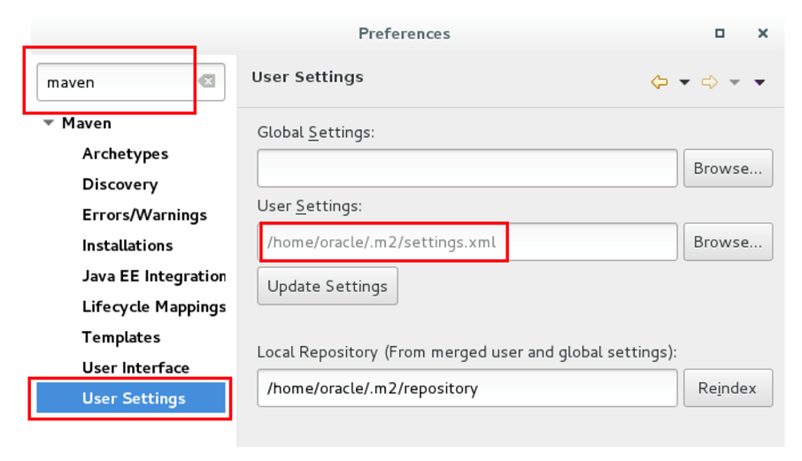
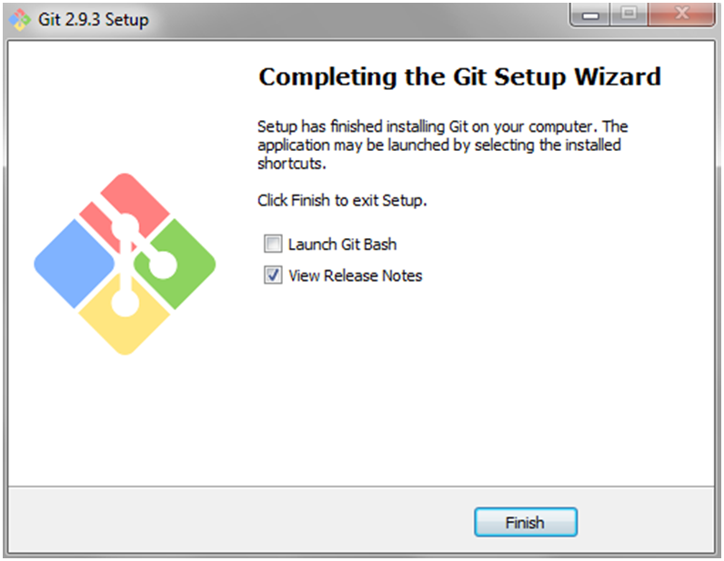
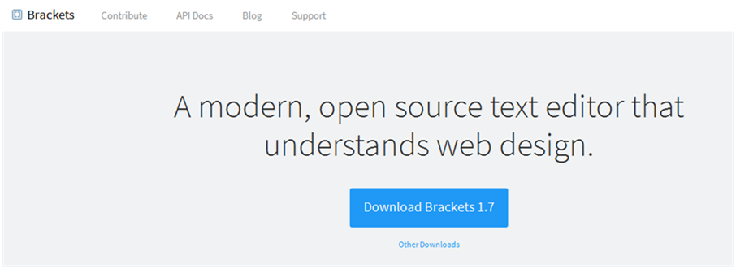
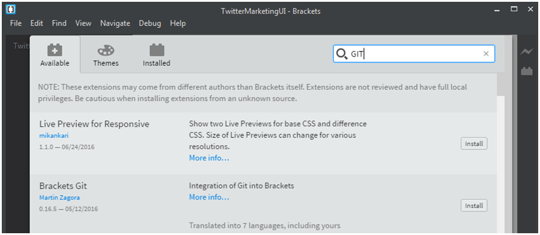
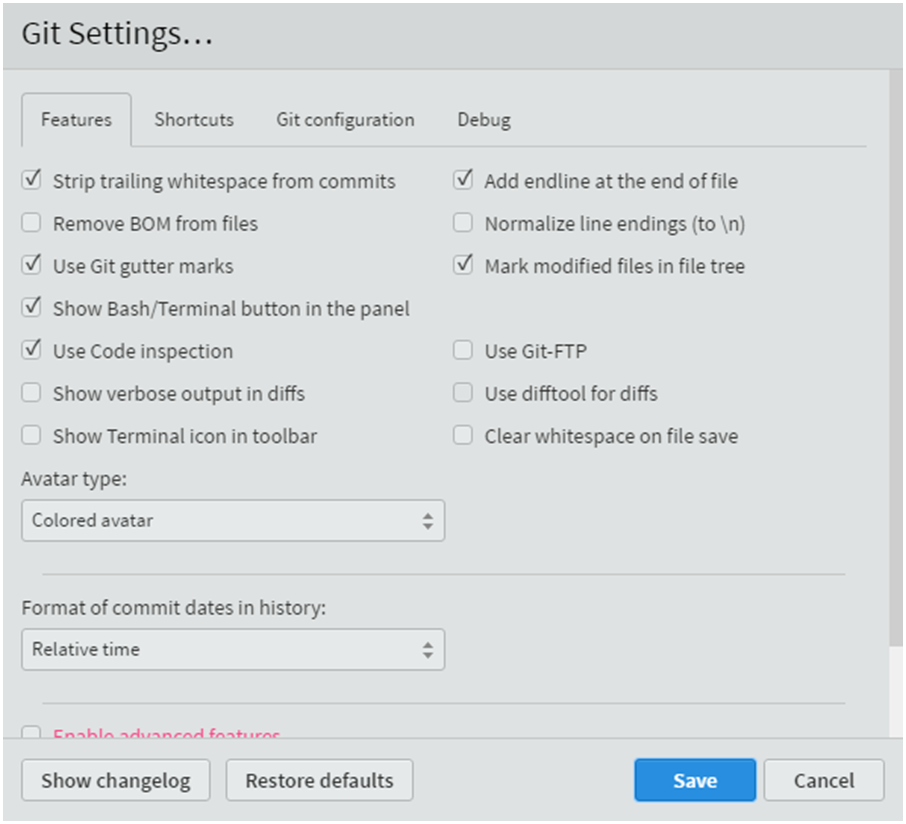
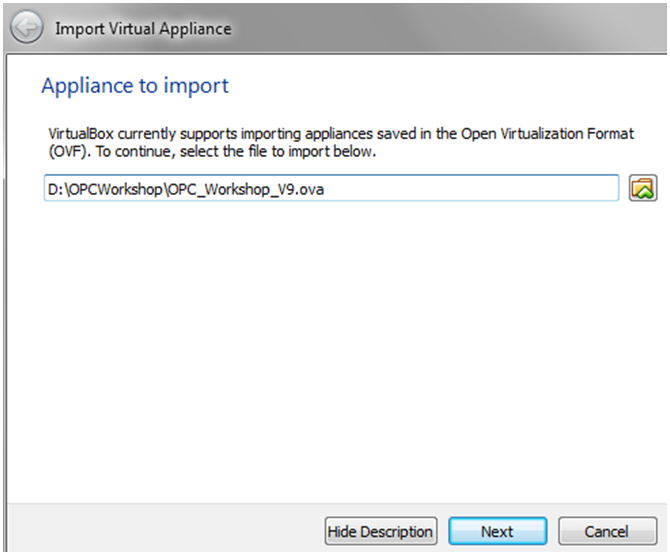
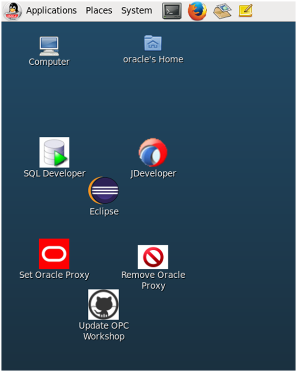

  
Update: January 28, 2017

## Introduction

This hands-on lab walks you through the software development lifecycle (SDLC) for a cloud-native microservices project. As the project manager persona, you will create a project and a backlog, manage tasks and features, define the sprint, and make assignments to developers. Once the sprint has been started, the Java developer will implement a Twitter feed service for retrieval and filtering of Twitter data. The JavaScript developer persona will create a Twitter marketing UI to display the data for analysis. During the session, you will gain exposure to Oracle Developer Cloud Service; Oracle Application Container Cloud; and open source products such as Eclipse, Maven, Git, and Brackets.

Please direct comments to: Dennis Foley (dennis.foley@oracle.com)

# Installing Eclipse

## Download and Install Eclipse

In this appendix you will download and install Eclipse containing the Oracle Plugin.

### **STEP 1**: Download Eclipse

- Go to the following URL: http://www.oracle.com/technetwork/developer-tools/eclipse/downloads/index.html

- Accept the **licensing agreement**, and then select the **Neon** version of Eclipse required for your operating system.

    

- Once you’ve downloaded eclipse, extract the zip file and install.

## Optionally Configure Proxies

### **STEP 2**: Configuring Proxies

If you are running Eclipse behind a firewall and need to configure the proxy setting, there are several updates to be made. First, you need to ensure that Eclipse’s proxy is set, next you need to update the maven proxy setting, and then finally, you need to ensure that the Oracle Plugin will work with your proxy settings.

- To set configure Eclipse’s proxy, open Eclipse and navigate to the Properties menu. Depending on the operating system, this drop down is found either from the **Eclipse > Preferences, or Window > Preferences**

    

- From the preferences panel, enter “**proxy**” into the search window, and click on **Network Connections**. Select **Native** for the Active Provider. This setting works well, but it requires that you have the proxy setting configured correctly on the system running Eclipse – e.g. Windows, MAC OS or Linux. Selecting Manual should also work, but some of the plugins require the underlying operating system’s proxy to be configured.

    

- To test that your connection works, select the menu option **Window > Show View > Other**

    

- Type “**web**” in the search field, select **Internal Web Browser** and click on **OK**

    

- Enter a **URL** into the browser and press **enter** to test your proxy settings.

    

### **STEP 3**:	Update the Eclipse / Maven proxy

- From the **Eclipse > Preference or Window > Preferences** panel, enter **Maven** into the search box. Click on the Maven User Settings. Make note of the directory where the settings.xml file is to be located. In the example below, the Maven User Settings are to be located in the **/home/oracle/.m2** directory

    

- Close Eclipse    

- If the directory does not exist where the settings.xml file is to be located, **create the directory**. In this example, we will create the **.m2** directory. 

- Also, create the **settings.xml** file, if it does not exist. Add the following to the settings.xml file (NOTE: you will need to use your correct **Host, Port, nonProxyHosts, username and Password settings**):

```
<?xml version="1.0" encoding="UTF-8"?>
<settings xmlns="http://maven.apache.org/SETTINGS/1.1.0" xmlns:xsi="http://www.w3.org/2001/XMLSchema-instance"
          xsi:schemaLocation="http://maven.apache.org/SETTINGS/1.1.0 http://maven.apache.org/xsd/settings-1.1.0.xsd">
  <proxies>
    <proxy>
      <active>true</active>
      <protocol>http</protocol>
      <username>proxyuser</username>
      <password>proxypass</password>
      <host>www-proxy.us.oracle.com</host>
      <port>80</port>
      <nonProxyHosts>local.net|some.host.com</nonProxyHosts>
    </proxy>
    <proxy>
      <active>true</active>
      <protocol>https</protocol>
      <username>proxyuser</username>
      <password>proxypass</password>
      <host>www-proxy.us.oracle.com</host>
      <port>80</port>
      <nonProxyHosts>local.net|some.host.com</nonProxyHosts>
    </proxy>
    </proxies>
</settings>
```

- Reload Eclipse to use the new maven settings

# Installing Brackets and Git

## Download and Install Git

### **STEP 4**: Download Git

- Go to the following URL: https://git-scm.com/downloads

    

- Select your OS. In our example, we will show how to install on Windows. Click **Windows** Download and click **Save File**

    

- Select your download location and click **Save**. We will use D:\Software    

    

- Open Windows Explorer and navigate you where you downloaded the Git executable. Double click on the Git executable to start the install process.

    

- Run through the installation process

    

## Download and Install Brackets Text Editor

### **STEP 5**: Download Brackets Text Editor

- Go to the following URL: http://brackets.io    

    

- Click **Download Brackets 1.X** then click **Save File**

    

- Select you download location and click **Save**. We will use D:\Software

    

- Open Windows Explorer and navigate you where you downloaded Brackets. Double click on the Brackets executable to start the install process.

    

- Run through the installation process

## Start Brackets and Configure Git

### **STEP 6**: Start Brackets and Configure Git

- Create a directory called **TwitterMarketingUI**. From Windows Explorer navigate to the directory **TwitterMarketingUI**, right click and select **Open as Brackets Project**

    

- Select **File -> Extension Manager…**

- In the search field, type **GIT**. Click **Install** for Brackets Git

    

- After the install completes, leave the defaults for Git Settings and click **Save**

    

- Click **OK** to restart Brackets

    

- You will now see the Git icon on the right-hand panel

    

# Alternative – Use Virtual Box Image

As an alternative to installing Eclipse, Brackets and Git on your laptop, you can follow these steps to download a Virtual Box image that will contain all those products pre-integrated together.

## Virtual Box Client Installation

### **STEP 7**: Copy OVA file

- Download and install Virtual box
https://www.virtualbox.org/wiki/Downloads  

- Download this workshops virtual box OVA zip files, and unzip
https://publicdocs-corp.documents.us2.oraclecloud.com/documents/folder/FA853951DE14FED12E559568F6C3FF17C1177E4725F3/_VM/nameasc

- Startup **Oracle Virtual Box**

    

- From top left menu select **File -> Import Appliance**

    

- Click on **browse** icon to select file to import.

- Navigate to the unzipped OVA file, and Click **Open**

    

- Once the File is selected click **Next** to continue.

    

- Keep all the defaults and click **Import**

    

- Wait for import to complete. The time required to import will vary depending on the speed of your hard disk.

    

- After completion of the import, you should see the Oracle Public Cloud image in a Powered Off state. The default settings will work, but if you are familiar with Virtual Box, you are welcome to change any of the settings.

    

- With the **Oracle Public Cloud** selected, click **Start**.

    

- After a few minutes you will have a running image that will be used for all of the labs.

    
